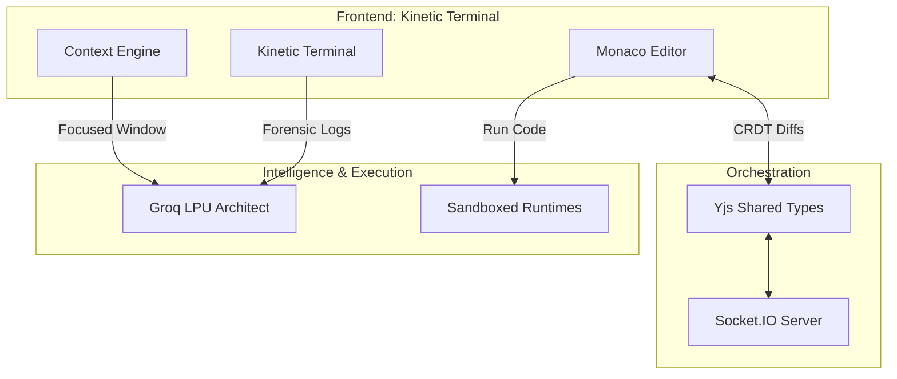

<div align="center">

# 🚀 Emerge - Developer's Den
### The Kinetic Forge for Collaborative Engineering

[](https://github.com/Purushotham-Prajapati-24/Emerge-2026/graphs/commit-activity)
[](#)
[](#)
[](https://opensource.org/licenses/MIT)
[](http://makeapullrequest.com)

**Developer's Den** is a high-performance, cloud-based collaborative IDE engineered for 100+ simultaneous users. 
It bridges the gap between raw CLI power and modern creative fluidity.

[**Explore the Docs**](./docs/archive) • [**GitHub Workflow**](./GITHUB.md) • [**Request Feature**](https://github.com/Purushotham-Prajapati-24/Emerge-2026/issues)

</div>

---

## 🏗️ The Engineering Blueprint

Our architecture is designed for **Laminar Flow Synchronization**. We utilize Yjs (CRDT) over WebSockets to ensure conflict-free editing even at high concurrency.



---

## ⚡ Live Visual Tour

Experience the **Kinetic Terminal** in action. Our interface is designed for focus, utilizing deep tonal shifts and glassmorphism.

| **The Workspace** | **AI Architect** |
| :---: | :---: |
|  |  |
| *Real-time collaborative editor* | *Context-aware engineering assistant* |

| **Project Dashboard** | **Multiplayer Chat** |
| :---: | :---: |
|  |  |
| *Team project management* | *Laminar sync communication* |

---


## 💎 Premium Features

| Feature | Description | Implementation |
| :--- | :--- | :--- |
| **Project Shadow** | Global session memory tracking recent files. | `useCollaborationStore` + Yjs |
| **Hyper-Focus** | AI context limited to ±50 lines for precision. | Dynamic Buffer Interceptor |
| **Forensic Debug** | Root-cause analysis of terminal outputs. | `/debug` Command Parser |
| **Multiplayer Cursor** | Real-time presence with user flags. | Socket.io Presence API |
| **Laminar Sync** | 100+ concurrent user support. | Yjs CRDT + WebSocket |

---

## 🛠️ The Tech Forge

<div align="center">

| Frontend | Backend | Database | AI & Auth |
| :---: | :---: | :---: | :---: |
|  |  |  |  |
| **React 19 / Vite** | **Node.js / Socket.io** | **MongoDB Atlas** | **Groq LPU / Clerk** |

</div>

---

## 📡 REST API Documentation

### Project Management
| Method | Endpoint | Description | Auth |
| :--- | :--- | :--- | :--- |
| `POST` | `/api/projects` | Initialize a new collaborative project. | ✅ |
| `GET` | `/api/projects` | Fetch all projects for the active user. | ✅ |
| `GET` | `/api/projects/:id` | Open a specific project workspace. | ✅ |
| `POST` | `/api/projects/:id/invite` | Invite a collaborator via email. | ✅ |
| `POST` | `/api/projects/:id/deploy` | Push project to Vercel/Production. | ✅ |

### Intelligence & Execution
| Method | Endpoint | Description | Auth |
| :--- | :--- | :--- | :--- |
| `POST` | `/api/ai/chat` | Query the Architect with context. | ✅ |
| `POST` | `/api/execution` | Execute code in isolated sandbox. | ✅ |

---

## 🚀 Installation & Setup

### Environment Checklist
Create `.env` files in both directories following this schema:

| Variable | Source | Purpose |
| :--- | :--- | :--- |
| `MONGODB_URI` | MongoDB Atlas | Data persistence. |
| `GROQ_API_KEY` | Groq Console | Intelligence Engine. |
| `CLERK_PUBLISHABLE_KEY` | Clerk Dash | OAuth & Identity. |
| `JWT_SECRET` | Manual | Session signing. |

### Terminal Jumpstart
```bash
# 1. Setup Backend
cd backend && npm install && npm run dev

# 2. Setup Frontend
cd frontend && npm install && npm run dev
```

---

## 🧬 Project Structure

```text
Emerge/
├── backend/              # Node.js Express Server
│   ├── src/controllers/  # Business Logic
│   ├── src/services/     # AI & Execution Logic
│   └── src/routes/       # API Definitions
├── frontend/             # React (Vite) Client
│   ├── src/features/     # Modular Components (AI, Editor)
│   ├── src/store/        # Zustand State Management
│   └── src/hooks/        # Specialized Logic (Real-time)
└── docs/archive/         # Technical Specifications
```

---

## 🤝 Contributing
Contributions are what make the open source community such an amazing place to learn, inspire, and create. Any contributions you make are **greatly appreciated**.

1. Fork the Project
2. Create your Feature Branch (`git checkout -b feat/AmazingFeature`)
3. Commit your Changes (`git commit -m 'feat: Add some AmazingFeature'`)
4. Push to the Branch (`git push origin feat/AmazingFeature`)
5. Open a Pull Request

---
<div align="center">
Built for the 2026 Hackathon Showcase.  
© 2026 Developer's Den Team.  
</div>
